# データベース設計

## 方針

- PostgreSQLを前提（マイグレーションは `golang-migrate`）
- IDはUUID v7（時系列ソート可能）
- 全テーブルに `created_at`, `updated_at`
- バックエンド固有データは `*_data JSONB` カラム（nullable）で保持

## ER図

```mermaid
erDiagram
    organizations {
        UUID id PK
        VARCHAR name UK
        INT quota_vcpus
        INT quota_ram_mb
        INT quota_volume_gb
        TIMESTAMPTZ created_at
        TIMESTAMPTZ updated_at
    }

    tenants {
        UUID id PK
        UUID organization_id FK
        VARCHAR name
        INT quota_vcpus
        INT quota_ram_mb
        INT quota_volume_gb
        INT quota_vms
        INT quota_volumes
        INT quota_snapshots
        INT quota_networks
        INT quota_floating_ips
        TIMESTAMPTZ created_at
        TIMESTAMPTZ updated_at
    }

    users {
        UUID id PK
        VARCHAR external_id UK "OIDC subject"
        VARCHAR name
        VARCHAR email
        TIMESTAMPTZ created_at
        TIMESTAMPTZ updated_at
    }

    role_assignments {
        UUID id PK
        UUID user_id FK
        VARCHAR scope_type "organization or tenant"
        UUID scope_id
        VARCHAR role "infra_admin, org_admin, tenant_admin, tenant_member"
        TIMESTAMPTZ created_at
    }

    hosts {
        UUID id PK
        VARCHAR name UK
        VARCHAR address
        UUID network_domain_id FK
        UUID location_id FK
        JSONB capability
        VARCHAR profile_id FK
        VARCHAR profile_status "in_sync, drifted, applying"
        VARCHAR operational_state "active, maintenance, draining, faulty, retiring"
        JSONB resource_physical "物理リソース量"
        JSONB overcommit_ratios
        TIMESTAMPTZ last_heartbeat
        TIMESTAMPTZ created_at
        TIMESTAMPTZ updated_at
    }

    host_storage_domains {
        UUID host_id FK
        UUID storage_domain_id FK
    }

    storage_domains {
        UUID id PK
        VARCHAR name UK
        TIMESTAMPTZ created_at
    }

    network_domains {
        UUID id PK
        VARCHAR name UK
        VARCHAR ovn_nb_connection "OVN Northbound DB接続先"
        TIMESTAMPTZ created_at
    }

    locations {
        UUID id PK
        UUID parent_id FK "nullable"
        VARCHAR name
        VARCHAR type "site, floor, row, rack, unit"
        JSONB fault_attributes "電源系統ID, 上位スイッチID等"
        TIMESTAMPTZ created_at
    }

    host_profiles {
        UUID id PK
        VARCHAR name UK
        JSONB software "カーネル, HV, エージェント, ドライバ"
        JSONB firmware "BIOS, BMC, NIC, GPU"
        JSONB kernel_params
        VARCHAR capability_match "対象capability条件"
        TIMESTAMPTZ created_at
        TIMESTAMPTZ updated_at
    }

    storage_backends {
        UUID id PK
        UUID storage_domain_id FK
        VARCHAR name UK
        VARCHAR driver "ceph, iscsi, nfs, local"
        VARCHAR status "registered, verifying, active, degraded, draining, readonly, retired"
        BIGINT capacity_bytes
        INT iops_limit
        INT bandwidth_mbps
        JSONB capabilities "SSD, encryption, replication, etc."
        JSONB driver_config
        TIMESTAMPTZ created_at
        TIMESTAMPTZ updated_at
    }

    volume_types {
        UUID id PK
        VARCHAR name UK
        JSONB required_capabilities
        JSONB qos_policy "IOPS/帯域の上限"
        TIMESTAMPTZ created_at
    }

    volumes {
        UUID id PK
        UUID tenant_id FK
        UUID backend_id FK
        UUID volume_type_id FK
        VARCHAR name
        INT size_gb
        VARCHAR status "creating, available, in_use, deleting, error"
        UUID parent_snapshot_id FK "nullable, クローン元"
        JSONB driver_data "nullable"
        TIMESTAMPTZ created_at
        TIMESTAMPTZ updated_at
    }

    snapshots {
        UUID id PK
        UUID volume_id FK
        UUID tenant_id FK
        VARCHAR name
        VARCHAR status "creating, available, deleting, error"
        TIMESTAMPTZ created_at
    }

    templates {
        UUID id PK
        VARCHAR name
        UUID owner_tenant_id FK "nullable"
        VARCHAR visibility "public, organization, tenant"
        UUID source_volume_id FK "nullable"
        VARCHAR format
        BIGINT size_bytes
        VARCHAR status
        TIMESTAMPTZ created_at
        TIMESTAMPTZ updated_at
    }

    template_caches {
        UUID id PK
        UUID template_id FK
        UUID backend_id FK
        VARCHAR status "copying, available, deleting"
        TIMESTAMPTZ last_used_at
        TIMESTAMPTZ created_at
    }

    vms {
        UUID id PK
        UUID tenant_id FK
        VARCHAR name
        UUID host_id FK "nullable"
        INT vcpus
        INT ram_mb
        JSONB numa_request "nullable, NUMA配置要件"
        VARCHAR status
        TEXT error_msg
        TIMESTAMPTZ created_at
        TIMESTAMPTZ updated_at
    }

    vm_volumes {
        UUID vm_id FK
        UUID volume_id FK
        VARCHAR device "vda, vdb, etc."
        BOOLEAN boot
    }

    networks {
        UUID id PK
        UUID tenant_id FK
        UUID network_domain_id FK
        VARCHAR name
        VARCHAR status
        TIMESTAMPTZ created_at
    }

    subnets {
        UUID id PK
        UUID network_id FK
        CIDR cidr
        INET gateway
        INET dhcp_range_start
        INET dhcp_range_end
        INET dns_servers "配列"
        TIMESTAMPTZ created_at
    }

    ports {
        UUID id PK
        UUID tenant_id FK
        UUID network_id FK
        UUID subnet_id FK
        UUID vm_id FK "nullable"
        MACADDR mac_address UK
        INET ip_address
        VARCHAR status
        JSONB driver_data "nullable"
        TIMESTAMPTZ created_at
    }

    port_security_groups {
        UUID port_id FK
        UUID security_group_id FK
    }

    routers {
        UUID id PK
        UUID tenant_id FK
        VARCHAR name
        UUID external_network_id FK "nullable"
        VARCHAR status
        TIMESTAMPTZ created_at
    }

    router_interfaces {
        UUID id PK
        UUID router_id FK
        UUID subnet_id FK
        INET ip_address
        TIMESTAMPTZ created_at
    }

    security_groups {
        UUID id PK
        UUID tenant_id FK
        VARCHAR name
        VARCHAR description
        TIMESTAMPTZ created_at
    }

    security_group_rules {
        UUID id PK
        UUID security_group_id FK
        VARCHAR direction "ingress, egress"
        VARCHAR ethertype "IPv4, IPv6"
        VARCHAR protocol "tcp, udp, icmp, null=any"
        INT port_range_min "nullable"
        INT port_range_max "nullable"
        CIDR remote_ip_prefix "nullable"
        UUID remote_group_id FK "nullable, SGの相互参照"
        TIMESTAMPTZ created_at
    }

    floating_ips {
        UUID id PK
        UUID tenant_id FK
        UUID external_network_id FK
        INET floating_ip
        UUID port_id FK "nullable"
        VARCHAR status
        TIMESTAMPTZ created_at
    }

    replication_policies {
        UUID id PK
        UUID source_backend_id FK
        UUID destination_backend_id FK
        VARCHAR schedule "cron式"
        INT retention_count
        VARCHAR status
        TIMESTAMPTZ created_at
    }

    organizations ||--o{ tenants : "has"
    tenants ||--o{ vms : "owns"
    tenants ||--o{ volumes : "owns"
    tenants ||--o{ snapshots : "owns"
    tenants ||--o{ networks : "owns"
    tenants ||--o{ ports : "owns"
    tenants ||--o{ routers : "owns"
    tenants ||--o{ security_groups : "owns"
    tenants ||--o{ floating_ips : "owns"
    users ||--o{ role_assignments : "has"

    hosts ||--o{ vms : "runs"
    hosts ||--o{ host_storage_domains : "belongs to"
    storage_domains ||--o{ host_storage_domains : "contains"
    storage_domains ||--o{ storage_backends : "contains"
    network_domains ||--o{ hosts : "contains"
    network_domains ||--o{ networks : "scoped to"
    locations ||--o{ hosts : "positions"
    locations ||--o{ locations : "parent"
    host_profiles ||--o{ hosts : "applied to"

    storage_backends ||--o{ volumes : "stores"
    storage_backends ||--o{ template_caches : "caches"
    volume_types ||--o{ volumes : "typed by"
    volumes ||--o{ vm_volumes : "attached"
    volumes ||--o{ snapshots : "has"
    snapshots ||--o{ volumes : "cloned from"
    vms ||--o{ vm_volumes : "uses"
    templates ||--o{ template_caches : "cached on"

    networks ||--o{ subnets : "contains"
    networks ||--o{ ports : "contains"
    subnets ||--o{ ports : "assigns IP"
    vms ||--o{ ports : "attached"
    ports ||--o{ port_security_groups : "has"
    security_groups ||--o{ port_security_groups : "applied to"
    security_groups ||--o{ security_group_rules : "has"
    routers ||--o{ router_interfaces : "has"
    subnets ||--o{ router_interfaces : "connected"
```



## ステータス遷移

### VM

```
scheduling → building → active → shutoff → active (restart)
    |           |          |        |
    v           v          v        v
  error       error     deleting  deleting → deleted
```

### ボリューム

```
creating → available → in_use → available (detach)
    |          |          |
    v          v          v
  error     deleting   deleting → deleted
               |
               v
           migrating → available
```

### ストレージバックエンド

```
registered → verifying → active → degraded → draining → readonly → retired
                |                     |
                v                     v
              error                 active (回復)
```

### ホスト

```
registering → active → maintenance → active
                 |          |
                 v          v
              draining → faulty
                 |
                 v
              retiring → retired
```

### スナップショット

```
creating → available → deleting → deleted
    |
    v
  error
```

## 設計判断

### driver_data JSONBカラムについて

- nullable。規約ベースのバックエンドではNULLのまま
- 外部システムが識別子を割り当てるバックエンドのみ使用
- バックエンド実装がJSONBの読み書きに責任を持つ（`json.RawMessage`で透過的に扱う）

### Capabilityの構造化データ

ホストのcapabilityとストレージバックエンドのcapabilitiesはJSONBで保持。構造化データとして格納し、JSONBのパス演算でクエリ可能。

### ロケーションの再帰構造

locationsテーブルはparent_idによる自己参照で任意深さのツリーを表現。WITH RECURSIVEでパス取得やサブツリー検索が可能。

### リソース量の管理

ホストの物理リソース量とオーバーコミット率はJSONBで保持。リソース種別の追加にスキーマ変更が不要。割当済み量はvmsテーブルからの集計で算出。
