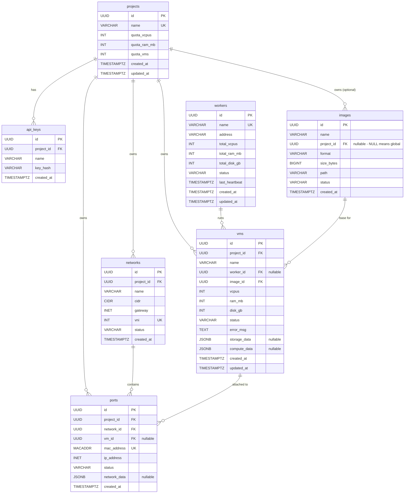

# データベース設計

## 方針

- PostgreSQLを前提（マイグレーションは `golang-migrate`）
- IDはUUID v7（時系列ソート可能）
- 全テーブルに `created_at`, `updated_at`
- バックエンド固有データは `*_data JSONB` カラム（nullable）で保持
  - localやOVSなど規約から導出できるバックエンドではNULLのまま
  - iSCSIや外部SDNなど、外部システムが識別子を割り当てるバックエンドのみ使用

## ER図



## DDL

```sql
CREATE TABLE projects (
    id          UUID PRIMARY KEY DEFAULT gen_random_uuid(),
    name        VARCHAR(63) NOT NULL UNIQUE,
    quota_vcpus INTEGER NOT NULL DEFAULT 20,
    quota_ram_mb INTEGER NOT NULL DEFAULT 51200,
    quota_vms   INTEGER NOT NULL DEFAULT 10,
    created_at  TIMESTAMPTZ NOT NULL DEFAULT now(),
    updated_at  TIMESTAMPTZ NOT NULL DEFAULT now()
);

CREATE TABLE api_keys (
    id          UUID PRIMARY KEY DEFAULT gen_random_uuid(),
    project_id  UUID NOT NULL REFERENCES projects(id),
    name        VARCHAR(63) NOT NULL,
    key_hash    VARCHAR(128) NOT NULL,
    created_at  TIMESTAMPTZ NOT NULL DEFAULT now()
);

CREATE TABLE workers (
    id          UUID PRIMARY KEY DEFAULT gen_random_uuid(),
    name        VARCHAR(63) NOT NULL UNIQUE,
    address     VARCHAR(255) NOT NULL,
    total_vcpus INTEGER NOT NULL,
    total_ram_mb INTEGER NOT NULL,
    total_disk_gb INTEGER NOT NULL,
    status      VARCHAR(20) NOT NULL DEFAULT 'unknown',
    last_heartbeat TIMESTAMPTZ,
    created_at  TIMESTAMPTZ NOT NULL DEFAULT now(),
    updated_at  TIMESTAMPTZ NOT NULL DEFAULT now()
);

CREATE TABLE images (
    id          UUID PRIMARY KEY DEFAULT gen_random_uuid(),
    name        VARCHAR(127) NOT NULL,
    project_id  UUID REFERENCES projects(id),
    format      VARCHAR(10) NOT NULL,
    size_bytes  BIGINT NOT NULL,
    path        VARCHAR(512) NOT NULL,
    status      VARCHAR(20) NOT NULL DEFAULT 'creating',
    created_at  TIMESTAMPTZ NOT NULL DEFAULT now()
);

CREATE TABLE networks (
    id          UUID PRIMARY KEY DEFAULT gen_random_uuid(),
    project_id  UUID NOT NULL REFERENCES projects(id),
    name        VARCHAR(63) NOT NULL,
    cidr        CIDR NOT NULL,
    gateway     INET NOT NULL,
    vni         INTEGER NOT NULL UNIQUE,
    status      VARCHAR(20) NOT NULL DEFAULT 'active',
    created_at  TIMESTAMPTZ NOT NULL DEFAULT now()
);

CREATE TABLE vms (
    id          UUID PRIMARY KEY DEFAULT gen_random_uuid(),
    project_id  UUID NOT NULL REFERENCES projects(id),
    name        VARCHAR(63) NOT NULL,
    worker_id   UUID REFERENCES workers(id),
    image_id    UUID NOT NULL REFERENCES images(id),
    vcpus       INTEGER NOT NULL,
    ram_mb      INTEGER NOT NULL,
    disk_gb     INTEGER NOT NULL,
    status      VARCHAR(20) NOT NULL DEFAULT 'scheduling',
    error_msg   TEXT,
    storage_data JSONB,
    compute_data JSONB,
    created_at  TIMESTAMPTZ NOT NULL DEFAULT now(),
    updated_at  TIMESTAMPTZ NOT NULL DEFAULT now()
);

CREATE TABLE ports (
    id          UUID PRIMARY KEY DEFAULT gen_random_uuid(),
    project_id  UUID NOT NULL REFERENCES projects(id),
    network_id  UUID NOT NULL REFERENCES networks(id),
    vm_id       UUID REFERENCES vms(id),
    mac_address MACADDR NOT NULL UNIQUE,
    ip_address  INET NOT NULL,
    status      VARCHAR(20) NOT NULL DEFAULT 'down',
    network_data JSONB,
    created_at  TIMESTAMPTZ NOT NULL DEFAULT now()
);

CREATE INDEX idx_vms_project ON vms(project_id);
CREATE INDEX idx_vms_worker ON vms(worker_id);
CREATE INDEX idx_vms_status ON vms(status);
CREATE INDEX idx_ports_vm ON ports(vm_id);
CREATE INDEX idx_ports_network ON ports(network_id);
CREATE INDEX idx_networks_project ON networks(project_id);
CREATE UNIQUE INDEX idx_vms_project_name ON vms(project_id, name);
CREATE UNIQUE INDEX idx_networks_project_name ON networks(project_id, name);
```

## ステータス遷移

### VM

```
scheduling → building → active → shutoff → active (restart)
                ↓          ↓        ↓
              error      deleting  deleting → deleted
```

### Image

```
creating → active → deleting
    ↓
  error
```

### Worker

```
unknown → online → offline (heartbeat timeout)
            ↓
        maintenance
```

### Port

```
down → active → error
         ↓
       down (VM削除時)
```

## 設計判断

### driver_data JSONBカラムについて

- nullable。localストレージやOVSなど規約ベースのバックエンドではNULLのまま
- iSCSI等、外部システムが識別子を割り当てるバックエンドのみ使用
- バックエンド実装がJSONBの読み書きに責任を持つ（`json.RawMessage`で透過的に扱う）

### ワーカーローカルstateについて

- バックエンド個別のDBは持たない（Phase 1）
- OVSのlocal_vlan_tagなどはOVS自体から取得可能
- worker起動時にcontrollerからstate同期してreconcile（再構築）する設計
- ワーカーローカルstateはあくまでキャッシュ的位置づけ

### worker容量計算

- vmsテーブルからworker_id別にSUM(vcpus), SUM(ram_mb)を集計
- workersテーブルのtotalと比較してスケジューリング

### IP/MAC割り当て

- IP: networkのCIDRから割り当て済みを除外して空きを検索（PostgreSQLのCIDR/INET型演算）
- MAC: `02:xx:xx:xx:xx:xx`（locally administered bit）でランダム生成、UNIQUE制約で衝突防止
