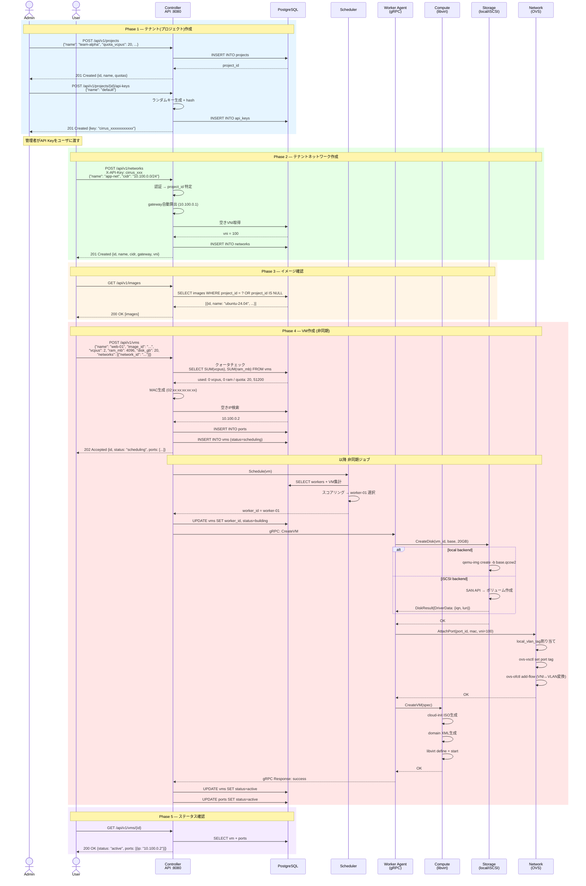

# シーケンス図

## テナント作成からVM起動までの全体フロー



## VM作成の内部フロー（詳細）

```
User → POST /api/v1/vms
  → API: 認証・クォータチェック
  → Scheduler: worker選定 (worker-01を選択)
  → DB: vm record作成 (status=SCHEDULING)
  → Controller→Worker-01: CreateVM RPC
    → Worker: storage.CreateDisk()
    → Worker: network.AttachPort()
    → Worker: compute.CreateVM()
  → DB: status=ACTIVE, worker=worker-01
  → Response: 201 Created {id, ip, status}
```

## Reconcile（worker起動時）

```
Worker起動
  → controller.GetWorkerState(workerID)
  → libvirtから実際のVM一覧取得
  → OVSから実際のポート一覧取得
  → 差分比較
    → DBにあるがlibvirtにない → エラー報告
    → libvirtにあるがDBにない → 孤立VMとして削除
```
