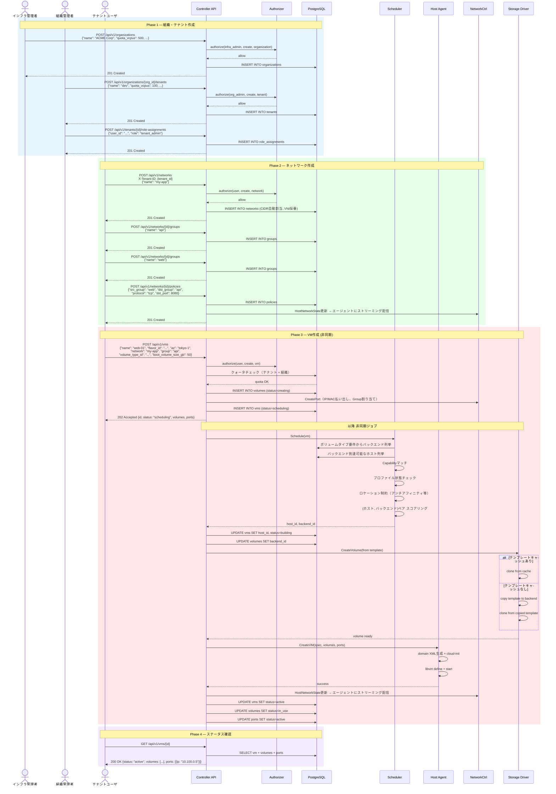
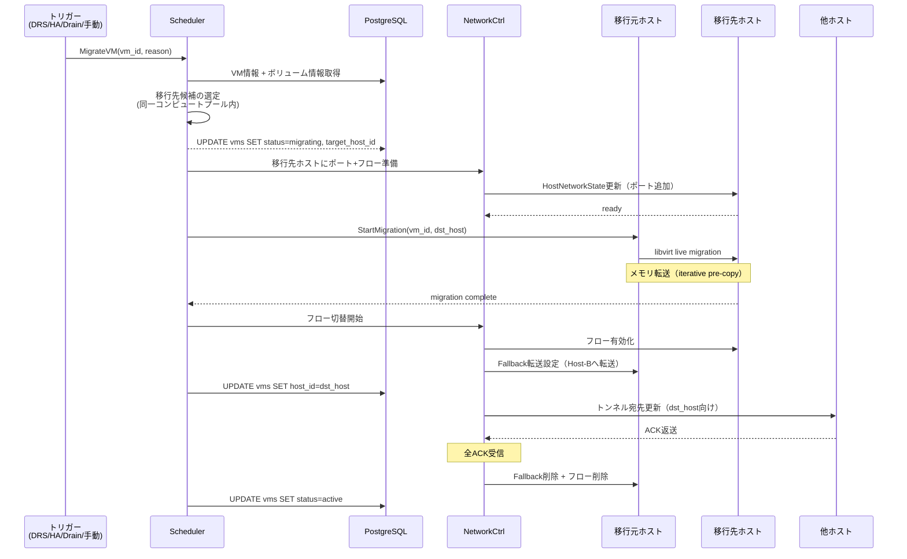

# シーケンス図

## テナント作成からVM起動までの全体フロー



## スケジューラの処理フロー

```
VM配置要求
│
├─ 1. コンピュートプール絞り込み
│     ├─ ボリュームタイプ → バックエンド候補
│     └─ バックエンド到達可能ホスト
│
├─ 2. Capabilityマッチ
│     ├─ CPU要件（世代、命令セット）
│     ├─ GPU要件
│     ├─ NUMAトポロジ要件
│     └─ SR-IOV要件
│
├─ 3. 状態フィルタ
│     ├─ operational_state = active のみ
│     └─ profile_status = in_sync のみ
│
├─ 4. ロケーション制約
│     ├─ アンチアフィニティルール
│     └─ アフィニティルール
│
├─ 5. スコアリング
│     ├─ ホスト: リソース空き率
│     ├─ ホスト: NUMAノード空き
│     ├─ バックエンド: 容量空き率
│     ├─ バックエンド: IOPS余裕
│     └─ テンプレートキャッシュの有無
│
└─ 6. 最終決定 → (host_id, backend_id) ペア
```

## ライブマイグレーション



## ストレージドレイン

```
ドレイン開始
│
├─ バックエンドstatus → draining
├─ 新規ボリューム作成を停止
│
├─ 依存関係を考慮した移行順序算出
│   ├─ 依存なしボリューム → 即座に移行
│   ├─ クローン元スナップショット → フラット化 → 移行
│   └─ 親ボリューム → 子のフラット化完了後に移行
│
├─ ボリュームごとに:
│   ├─ 移行先バックエンド選定 (スケジューラ)
│   ├─ ストレージライブマイグレーション実行
│   └─ 帯域制限の適用
│
├─ 進捗可視化
│   ├─ 残りボリューム数
│   ├─ 残りデータ量
│   └─ 推定完了時間
│
└─ 全ボリューム移行完了 → readonly → retired
```
