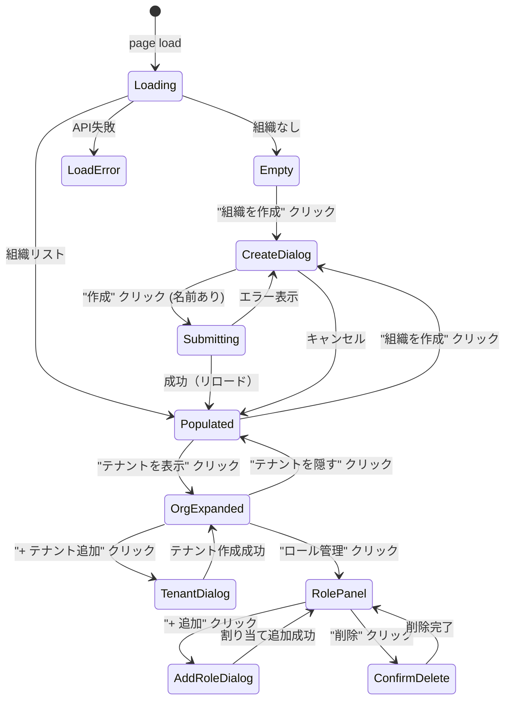

# GUI Spec — S046-1: 組織・テナント・ロール管理

Sprint: S046  
Story: S046-1  
Generated: 2026-04-08

## ページ

`/admin/organizations` — 既存ページ (OrganizationsPage.tsx) に `data-testid` を追加。

## 確認済みシナリオ

### Entry Point
管理者コンソールのサイドナビ「組織・テナント」リンク、または直接 URL。

### Happy Path
1. `/admin/organizations` にアクセス → 組織リストを取得
2. 「+ 組織を作成」ボタン → ダイアログ開く
3. 組織名を入力 → 「作成」クリック → ダイアログ閉じる、リスト再取得
4. 組織行の「テナントを表示」→ テナントリスト展開
5. 「+ テナント追加」→ テナント作成ダイアログ → 作成
6. テナント行の「ロール管理」→ ロール割り当てパネル開く
7. 「+ 追加」→ ユーザーID + ロール選択 → 追加
8. ロール行の「削除」→ 確認ダイアログ → 削除完了

### Data States
- 空リスト: `data-testid="empty-orgs"` 表示
- 読み込み中: 「読み込み中...」テキスト
- エラー: `data-testid="org-list-error"` 表示

### Edge Cases
- 組織名が空 → 作成ボタン無効 (クライアントバリデーション)
- 名前重複 → サーバー 409 → ダイアログ内エラー表示 (`data-testid="create-org-error"`)
- ユーザーID 空 → ロール追加ボタン無効

### Success Feedback
ダイアログ閉じ + リスト自動更新（toast なし、既存実装に合わせる）

### Failure Feedback
ダイアログ内インラインエラーメッセージ

## 状態遷移図



## 必須 data-testid 一覧

| Element | data-testid |
|---------|------------|
| 空状態メッセージ | `empty-orgs` |
| 組織リストエラー | `org-list-error` |
| 「組織を作成」ボタン | `create-org-button` |
| 組織作成ダイアログ | `create-org-dialog` |
| 組織名 Input | `org-name-input` |
| 組織作成送信ボタン | `create-org-submit` |
| 組織作成エラー | `create-org-error` |
| 組織行 | `org-row-{id}` |
| テナント展開ボタン | `expand-tenants-button-{id}` |
| テナント追加ボタン | `create-tenant-button-{id}` |
| テナント作成ダイアログ | `create-tenant-dialog` |
| テナント名 Input | `tenant-name-input` |
| テナント作成送信ボタン | `create-tenant-submit` |
| テナント行 | `tenant-row-{id}` |
| ロール管理ボタン | `role-management-button-{id}` |
| ロール追加ボタン | `add-role-button` |
| ロール追加ダイアログ | `add-role-dialog` |
| ユーザーID Input | `role-user-id-input` |
| ロール選択 | `role-select` |
| ロール追加送信ボタン | `add-role-submit` |
| ロール行 | `role-row-{user_id}` |
| ロール削除ボタン | `delete-role-button-{user_id}` |
| 削除確認ダイアログ | `confirm-delete-dialog` |
| 削除確認ボタン | `confirm-delete-button` |

## Playwright テスト

`web/e2e/admin-s046-1.spec.ts`

```
npx playwright test admin-s046-1
```
