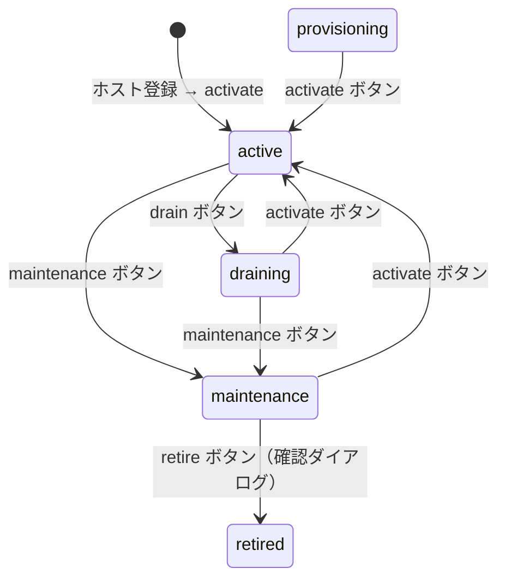
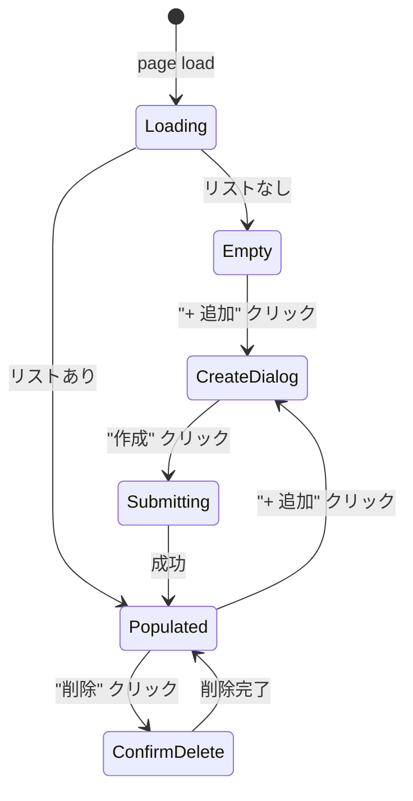

# GUI Spec — S046-2: ホスト・ストレージ・Flavor・GW ノード・IP プール管理

Sprint: S046  
Story: S046-2  
Generated: 2026-04-08

## ページ

- `/admin/hosts` — 既存ページ (HostsPage.tsx) に `data-testid` 追加
- `/admin/storage` — 既存ページ (StoragePage.tsx) に `data-testid` 追加
- `/admin/network` — **新規ページ** (NetworkInfraPage.tsx): GW ノード + IP プール 2 セクション構成

## ホスト管理シナリオ

### Happy Path
1. ホスト一覧表示 → 各ホストの状態バッジ確認
2. 状態に応じたアクションボタン表示（active: drain/maintenance、maintenance: activate/retire）
3. drain/maintenance/activate ボタンクリック → 即時状態更新
4. retire クリック → 確認ダイアログ → 廃止
5. 「+ ホストを追加」→ フォーム → 作成完了

### 状態遷移図



### 必須 data-testid (ホスト)

| Element | data-testid |
|---------|------------|
| 空状態 | `empty-hosts` |
| ホスト行 | `host-row-{id}` |
| ステータスバッジ | `host-status-{id}` |
| アクションボタン | `host-action-{action}-{id}` (action: drain/maintenance/activate/retire) |
| retire 確認ダイアログ | `confirm-retire-dialog` |
| 「ホストを追加」ボタン | `create-host-button` |
| ホスト作成ダイアログ | `create-host-dialog` |
| ホスト名 Input | `host-name-input` |
| アドレス Input | `host-address-input` |
| vCPU Input | `host-vcpus-input` |
| メモリ Input | `host-memory-input` |
| 作成送信ボタン | `create-host-submit` |

## ストレージ管理シナリオ

StoragePage.tsx は Storage Backend / Volume Type / Flavor の 3 セクション。

### 必須 data-testid (ストレージ)

| Element | data-testid |
|---------|------------|
| Backend 行 | `backend-row-{id}` |
| Backend 削除ボタン | `delete-backend-button-{id}` |
| Backend 追加ボタン | `create-backend-button` |
| Backend 作成ダイアログ | `create-backend-dialog` |
| Backend 名 Input | `backend-name-input` |
| Volume Type 行 | `volume-type-row-{id}` |
| Flavor 行 | `flavor-row-{id}` |
| Flavor 追加ボタン | `create-flavor-button` |
| Flavor 作成ダイアログ | `create-flavor-dialog` |
| Flavor 名 Input | `flavor-name-input` |
| Flavor vCPU Input | `flavor-vcpus-input` |
| Flavor メモリ Input | `flavor-memory-input` |
| Flavor ディスク Input | `flavor-disk-input` |
| Flavor 作成送信ボタン | `create-flavor-submit` |
| 削除確認ダイアログ | `confirm-delete-dialog` |
| 削除確認ボタン | `confirm-delete-button` |

## ネットワーク管理シナリオ (新規ページ `/admin/network`)

GW ノードと IP プールを 2 セクションで表示。StoragePage と同パターン。

### 状態遷移図



### 必須 data-testid (ネットワーク管理)

| Element | data-testid |
|---------|------------|
| GW ノード空状態 | `empty-gateway-nodes` |
| GW ノード追加ボタン | `create-gateway-node-button` |
| GW ノード作成ダイアログ | `create-gateway-node-dialog` |
| Host ID Input | `gateway-node-host-id-input` |
| External IP Input | `gateway-node-external-ip-input` |
| Internal IP Input | `gateway-node-internal-ip-input` |
| 作成送信ボタン | `create-gateway-node-submit` |
| GW ノード行 | `gateway-node-row-{id}` |
| GW ノード削除ボタン | `delete-gateway-node-button-{id}` |
| IP プール追加ボタン | `create-ip-pool-button` |
| IP プール作成ダイアログ | `create-ip-pool-dialog` |
| プール名 Input | `ip-pool-name-input` |
| CIDR Input | `ip-pool-cidr-input` |
| 作成送信ボタン | `create-ip-pool-submit` |
| IP プール行 | `ip-pool-row-{id}` |
| IP プール削除ボタン | `delete-ip-pool-button-{id}` |
| 削除確認ダイアログ | `confirm-delete-dialog` |
| 削除確認ボタン | `confirm-delete-button` |

## Playwright テスト

`web/e2e/admin-s046-2.spec.ts`

```
npx playwright test admin-s046-2
```
