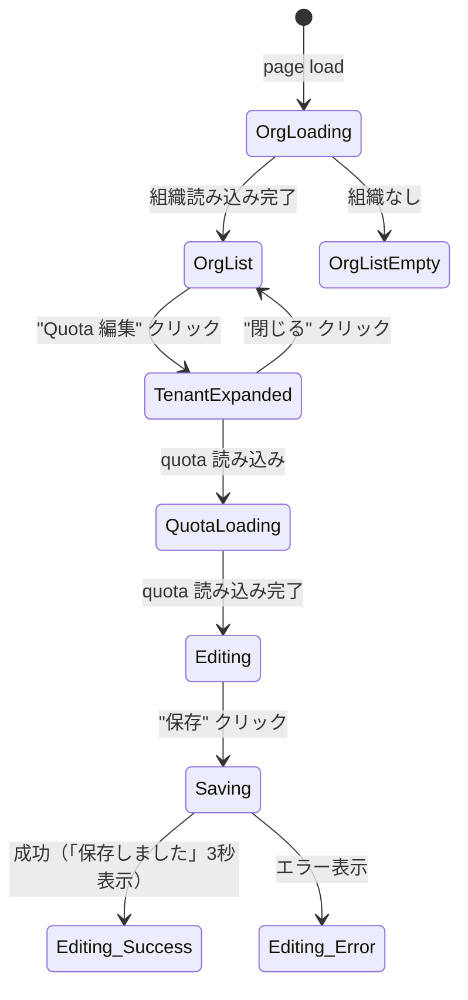
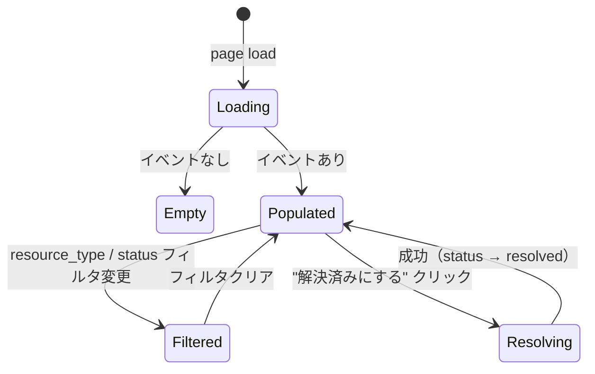

# GUI Spec — S046-3: Quota 設定 / Drift Event ビューア

Sprint: S046  
Story: S046-3  
Generated: 2026-04-08

## ページ

- `/admin/quotas` — 既存ページ (QuotasPage.tsx)。旧 API → 新 API に更新、Networks/Egresses/Ingresses フィールド追加、`data-testid` 追加
- `/admin/drift-events` — 既存スタブ (DriftEventsPage.tsx) を完全実装。バックエンド API も本 Sprint で実装。

## Quota 設定シナリオ

### Happy Path
1. 組織リスト取得 → テナント行に「Quota 編集」ボタン
2. クリック → テナント内の Quota フォーム展開（PUT /tenants/{id}/quota）
3. 値変更 → 「保存」→ 「保存しました」3 秒表示

### 表示フィールド (API: `/tenants/{id}/quota`)
- vCPU 上限 (`limits.vcpus`)
- メモリ上限 MB (`limits.memory_mb`)
- VM 数上限 (`limits.vm_count`)
- ボリューム容量上限 GB (`limits.volume_gb`)
- ネットワーク数上限 (`limits.networks`) ← 追加
- Egress 数上限 (`limits.egresses`) ← 追加
- Ingress 数上限 (`limits.ingresses`) ← 追加

### 状態遷移図



### 必須 data-testid (Quota)

| Element | data-testid |
|---------|------------|
| 空状態（組織なし） | `empty-orgs-quota` |
| Quota 編集ボタン | `quota-edit-button-{tenantId}` |
| vCPU Input | `quota-vcpus-{tenantId}` |
| メモリ Input | `quota-memory-{tenantId}` |
| VM 数 Input | `quota-vm-count-{tenantId}` |
| ボリューム GB Input | `quota-volume-gb-{tenantId}` |
| ネットワーク数 Input | `quota-networks-{tenantId}` |
| Egress 数 Input | `quota-egresses-{tenantId}` |
| Ingress 数 Input | `quota-ingresses-{tenantId}` |
| 保存ボタン | `quota-save-button-{tenantId}` |
| 保存成功メッセージ | `quota-save-success-{tenantId}` |
| 保存エラーメッセージ | `quota-save-error-{tenantId}` |

## Drift Events シナリオ

### バックエンド実装 (本 Sprint で追加)
- `GET /api/v1/admin/drift-events?status=&resource_type=` → `{ items: DriftEvent[], next_cursor: "" }`
- `PATCH /api/v1/admin/drift-events/{id}` body: `{ status: "resolved" }` → DriftEvent

### Happy Path
1. Drift Event 一覧取得 → テーブル表示
2. resource_type / status フィルタ変更 → API 再取得
3. open イベントの「解決済みにする」→ PATCH → status が resolved に更新

### Edge Cases
- resolved イベントには「解決済みにする」ボタン非表示
- 空リスト → 空状態表示

### 状態遷移図



### 必須 data-testid (Drift Events)

| Element | data-testid |
|---------|------------|
| 空状態 | `empty-drift-events` |
| イベント行 | `drift-row-{id}` |
| ステータス表示 | `drift-status-{id}` |
| resource_type フィルタ | `drift-filter-resource-type` |
| status フィルタ | `drift-filter-status` |
| 解決ボタン（open のみ） | `resolve-drift-button-{id}` |

## Playwright テスト

`web/e2e/admin-s046-3.spec.ts`

```
npx playwright test admin-s046-3
```
