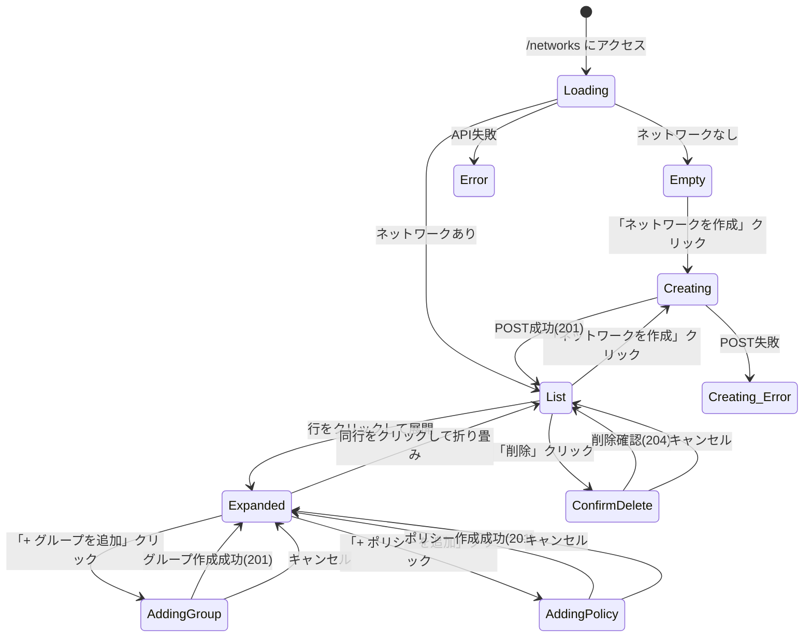

# GUI Spec — S048-1: ネットワーク・グループ・ポリシー管理

## 確認済みシナリオ

### エントリポイント
ナビゲーションメニュー → 「ネットワーク」→ `/networks`

### ハッピーパス
1. ネットワーク一覧を表示（name, CIDR, status）
2. 「ネットワークを作成」→ モーダル（name 必須、CIDR 任意）→ 201 → リスト更新
3. 行クリックで展開 → グループ・ポリシーパネル表示
4. グループ追加（name）→ 201 → リスト更新
5. ポリシー追加（src_group/dst_group ドロップダウン、protocol/dst_port/priority/action）→ 201 → リスト更新
6. 削除ボタン → 確認ダイアログ → 204 → リスト更新

### 状態遷移図



## エンドポイントコントラクト表

| Endpoint | Method | Router登録確認 | リクエストフィールド | レスポンスフィールド |
|---|---|---|---|---|
| `/api/v1/networks` | GET | ✓ | — | `{items: Network[], next_cursor: string}` |
| `/api/v1/networks` | POST | ✓ | `{name: string, cidr?: string}` | `Network` (201) |
| `/api/v1/networks/{id}` | DELETE | ✓ | — | 204 |
| `/api/v1/networks/{id}/groups` | GET | ✓ | — | `{items: Group[], next_cursor: string}` |
| `/api/v1/networks/{id}/groups` | POST | ✓ | `{name: string}` | `Group` (201) |
| `/api/v1/networks/{id}/groups/{gid}` | DELETE | ✓ | — | 204 |
| `/api/v1/networks/{id}/policies` | GET | ✓ | — | `{items: Policy[], next_cursor: string}` |
| `/api/v1/networks/{id}/policies` | POST | ✓ | `{src_group_id, dst_group_id, protocol, dst_port?, priority?, action?}` | `Policy` (201) |
| `/api/v1/networks/{id}/policies/{pid}` | DELETE | ✓ | — | 204 |

### Network 構造体
```
id, tenant_id, name, cidr, vni, status, created_at, updated_at
```

### Group 構造体
```
id, network_id, name, created_at
```

### Policy 構造体
```
id, network_id, src_group_id, dst_group_id, protocol, dst_port?, priority, action, created_at
```

## Playwright テストファイル
`web/e2e/s048-network.spec.ts`
