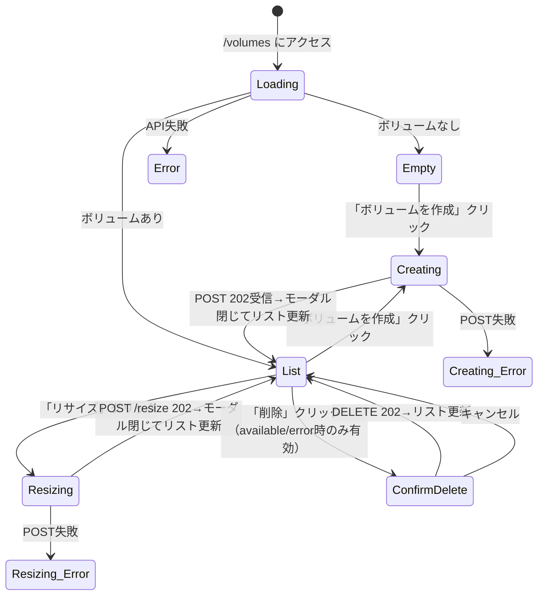

# GUI Spec — S048-2: ボリューム管理

## 確認済みシナリオ

### エントリポイント
ナビゲーションメニュー → 「ボリューム」→ `/volumes`

### ハッピーパス
1. ボリューム一覧を表示（name, size_gb, state バッジ, volume_type, created_at）
2. 「ボリュームを作成」→ モーダル（name 必須、size_gb 必須、volume_type_id 任意）→ 202 {job_id} → モーダル閉じてリスト更新
3. 「リサイズ」→ モーダル（new_size_gb > 現在値）→ 202 → リスト更新
4. 「削除」（available/error のみ有効）→ 確認ダイアログ → 202 → リスト更新

### Volume state バッジ対応
- `creating` → 作成中（warning）
- `available` → 利用可能（success）
- `in_use` → 使用中（accent）
- `deleting` → 削除中（warning）
- `error` → エラー（danger）

### 状態遷移図



## エンドポイントコントラクト表

| Endpoint | Method | Router登録確認 | リクエストフィールド | レスポンスフィールド |
|---|---|---|---|---|
| `/api/v1/volumes` | GET | ✓ | — | `{items: Volume[], next_cursor: string}` |
| `/api/v1/volumes` | POST | ✓ | `{name, size_gb, volume_type_id?, az_id?}` | `{job_id: string}` (202) |
| `/api/v1/volumes/{id}` | DELETE | ✓ | — | `{job_id: string}` (202) |
| `/api/v1/volumes/{id}/resize` | POST | ✓ | `{new_size_gb: number}` | `{job_id: string}` (202) |
| `/api/v1/volume-types` | GET | ✓ | — | `VolumeType[]`（配列直接、ページングなし） |

### Volume 構造体
```
id, tenant_id, name, volume_type_id?, backend_id?, size_gb, state, exported_host_id?, az_id?, created_at, updated_at
```
※ フィールド名は `state`（`status` ではない）、使用中は `in_use`（`in-use` ではない）

### VolumeType 構造体
```
id, name, description?, required_capabilities, qos_policy?, is_public, created_at, updated_at
```

## Playwright テストファイル
`web/e2e/s048-volume.spec.ts`
