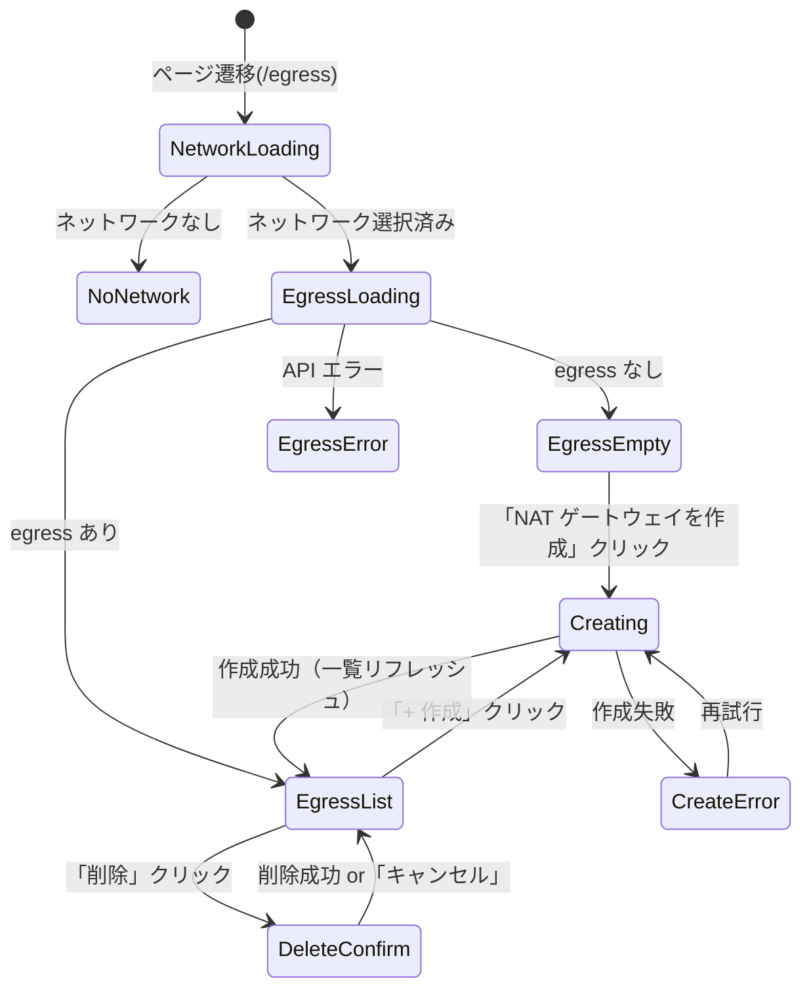
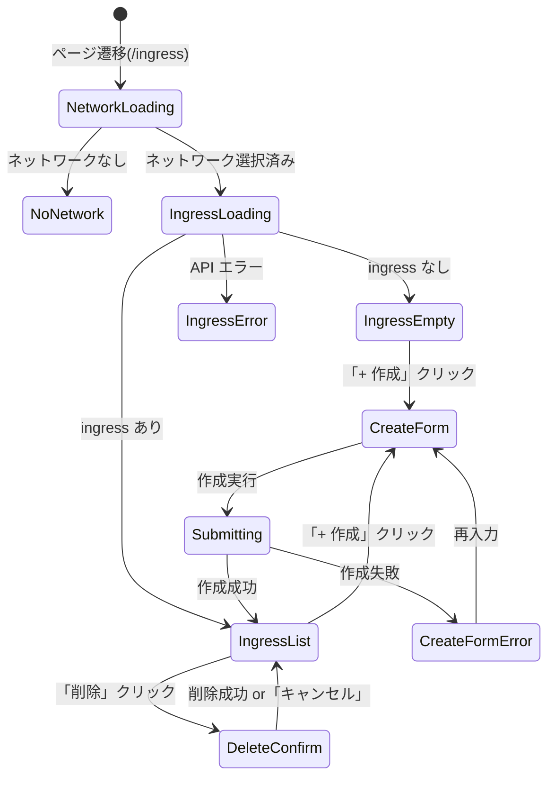

# GUI Spec: S049-1 — Egress / Ingress 管理

## 状態遷移図

### Egress 管理



### Ingress 管理



## エンドポイント契約表

| Endpoint | Method | Router 登録確認 | Request フィールド | Response フィールド |
|---|---|---|---|---|
| `/api/v1/networks` | GET | ✓ | — | `{items: [{id, name, cidr, ...}], next_cursor}` |
| `/api/v1/tenants/{id}/networks/{nid}/egresses` | GET | ✓ | — | `[{id, network_id, type, config: {public_ip}}]` |
| `/api/v1/tenants/{id}/networks/{nid}/egresses` | POST | ✓ | `{type, config}` | `{id, network_id, type, config}` |
| `/api/v1/tenants/{id}/networks/{nid}/egresses/{eid}` | DELETE | ✓ | — | 204 |
| `/api/v1/networks/{nid}/ingresses` | GET | ✓ | — | `[{id, network_id, type, public_ip, ip_pool_id, config: {target_vm_id, target_ip}, created_at}]` |
| `/api/v1/networks/{nid}/ingresses` | POST | ✓ | `{type, public_ip, ip_pool_id, config: {target_vm_id}}` | Ingress |
| `/api/v1/networks/{nid}/ingresses/{iid}` | DELETE | ✓ | — | 204 |
| `/api/v1/admin/ip-pools` | GET | ✓ | — | `[{id, name, cidr, description, created_at}]` |
| `/api/v1/tenants/{id}/vms` | GET | ✓ | — | `{items: [{id, name, ...}], next_cursor}` |

## フロントエンド修正方針

### `web/src/api/egress.ts`

正しい型：
```typescript
export interface Egress {
  id: string
  network_id: string
  type: string           // "nat_gateway"
  config: {
    public_ip?: string   // SNAT IP (バックエンドが割当)
  }
}

export interface CreateEgressRequest {
  type: string           // "nat_gateway"
  config: Record<string, unknown>
}
```

### `web/src/api/ingress.ts`

正しい型：
```typescript
export interface Ingress {
  id: string
  network_id: string
  type: string           // "direct_ip"
  public_ip: string
  ip_pool_id: string
  config: {
    target_vm_id: string
    target_ip: string
  }
  created_at: string
}

export interface CreateIngressRequest {
  type: string           // "direct_ip"
  public_ip: string
  ip_pool_id: string
  config: {
    target_vm_id?: string
  }
}
```

## Playwright テスト

→ `web/e2e/s049-egress-ingress.spec.ts`
