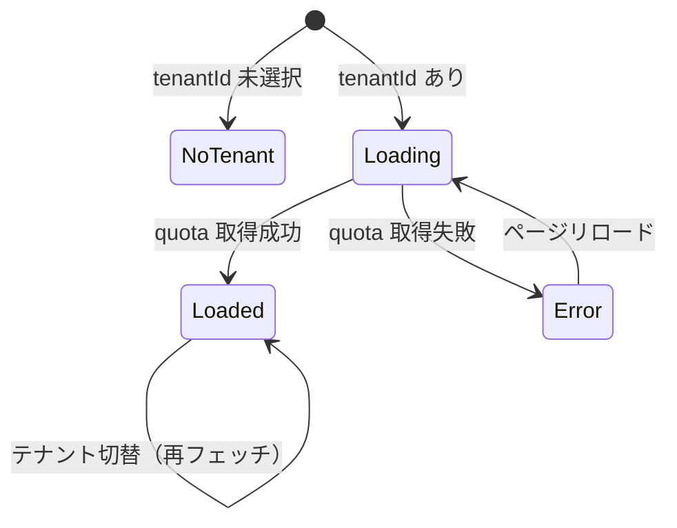

# GUI Spec: S049-2 — ダッシュボード

## 状態遷移図

## 表示要素

### サマリカード（5枚）

| カード | 表示値 | ソースフィールド |
|---|---|---|
| VM 数 | `{vm_count_used}` 台 | `usage.vm_count_used` |
| ネットワーク数 | `{networks_used}` 個 | `usage.networks_used` |
| ボリューム容量 | `{volume_gb_used}` GB | `usage.volume_gb_used` |
| vCPU | `{vcpus_used} / {vcpus}` | `usage.vcpus_used` / `limits.vcpus` |
| メモリ | `{memory_mb_used/1024} / {memory_mb/1024}` GB | `usage.memory_mb_used` / `limits.memory_mb` |

### Quota バー（6本）

| リソース | 使用量 | 上限 |
|---|---|---|
| vCPU | `vcpus_used` | `vcpus` |
| メモリ | `memory_mb_used` | `memory_mb` |
| VM 数 | `vm_count_used` | `vm_count` |
| ボリューム容量 (GB) | `volume_gb_used` | `volume_gb` |
| ネットワーク数 | `networks_used` | `networks` |
| ボリューム数 | `volumes_used` | `volumes` |

## エンドポイント契約表

| Endpoint | Method | Router 登録確認 | Request | Response フィールド |
|---|---|---|---|---|
| `/api/v1/tenants/{id}/quota` | GET | ✓ | — | `{limits: {vcpus, memory_mb, vm_count, volume_gb, volumes, snapshots, networks, egresses, ingresses}, usage: {tenant_id, vcpus_used, memory_mb_used, vm_count_used, volume_gb_used, volumes_used, snapshots_used, networks_used, egresses_used, ingresses_used}}` |

## Playwright テスト

→ `web/e2e/s049-dashboard.spec.ts`
