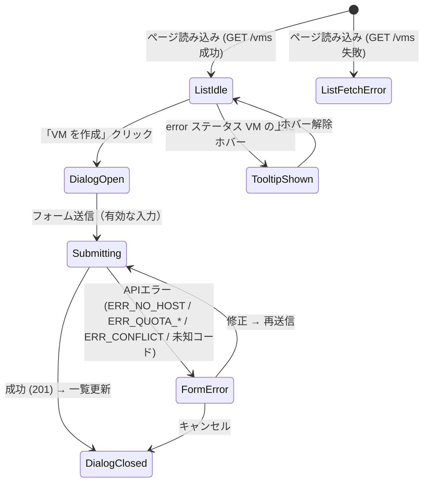

# GUI Spec: Story S051-2

テナントメンバー・管理者として、GUI 操作でエラーが発生した際に原因と対処方法がわかるメッセージを見たい。

## エンドポイントコントラクト

| Endpoint | Method | 登録確認 | リクエストフィールド | レスポンスフィールド |
|---|---|---|---|---|
| `/api/v1/vms` | POST | ✓ | `name`, `flavor_id`, `network_id`, `az_id?`, `volume_type_id?`, `volume_size_gb?` | `{"job_id": "uuid"}` |
| `/api/v1/vms` | GET | ✓ | — | `{items: Vm[], next_cursor: string}` |
| `/api/v1/flavors` | GET | ✓ | — | `{items: Flavor[], next_cursor: string}` |
| `/api/v1/networks` | GET | ✓ | — | `{items: Network[], next_cursor: string}` |
| `/api/v1/availability-zones` | GET | ✓ | — | `{items: AvailabilityZone[], next_cursor: string}` |
| `/api/v1/volume-types` | GET | ✓ | — | `{items: VolumeType[], next_cursor: string}` |

新しいエラーレスポンス形式（S051-1 で実装）:
```json
{"code": "ERR_NO_HOST", "message": "...", "detail": {...}}
```

## 状態遷移図



## シナリオ

### 1. VM作成: ERR_NO_HOST
- フォーム入力 → POST `/api/v1/vms` → 422 `{"code": "ERR_NO_HOST", ...}`
- 表示: 「利用可能なホストがありません。しばらく待ってから再試行するか、AZ を変更してください。」

### 2. VM作成: ERR_QUOTA_VCPU (detail あり)
- POST → 422 `{"code": "ERR_QUOTA_VCPU", ..., "detail": {"resource": "vcpu", "limit": 8, "current": 7}}`
- 表示: 「クォータ上限に達しています（vcpu: 7/8）。不要なリソースを削除するか、管理者にクォータ増加を依頼してください。」

### 3. VM作成: ERR_CONFLICT
- POST → 409 `{"code": "ERR_CONFLICT", ...}`
- 表示: 「同じ名前のリソースが既に存在します。別の名前を指定してください。」

### 4. VM作成: 未知エラーコード
- POST → 500 `{"code": "ERR_INTERNAL", "message": "予期しないエラーが発生しました"}`
- 表示: `message` フィールドをそのままフォールバック表示

### 5. VM一覧: error ステータスの VM
- VM が `status: "error"`, `error_message: "..."` を持つ
- VM行にホバー → ツールチップで `error_message` の内容を表示

## 必要な data-testid

| testid | 対象 |
|---|---|
| `form-error` | CreateVmDialog 内エラーメッセージ (`<p>` → `ErrorMessage` コンポーネントに変更) |
| `vm-row-{id}` | VM一覧の各行 (`<tr>`) |
| `vm-status-badge-{id}` | VmStatusBadge コンポーネント |
| `vm-error-tooltip-trigger-{id}` | error ステータス時のツールチップトリガー |
| `vm-error-tooltip-content-{id}` | ツールチップの本文 |

## Playwright テスト

`web/e2e/s051-error-ux.spec.ts` を参照。
